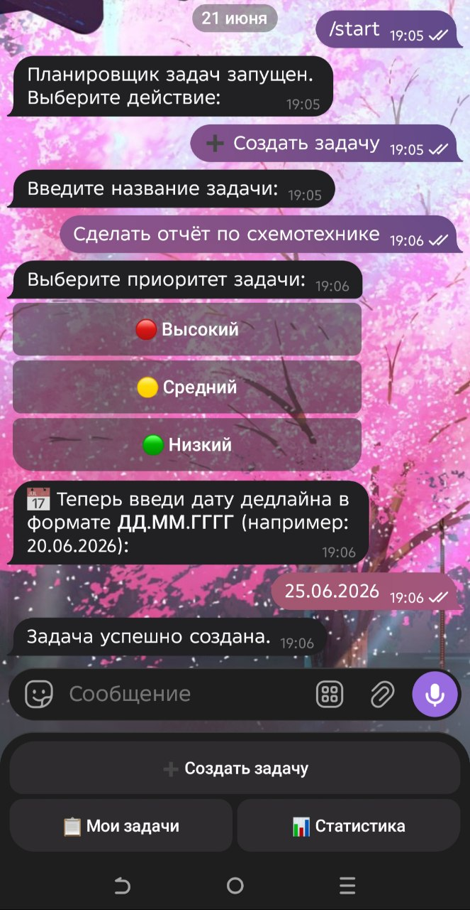
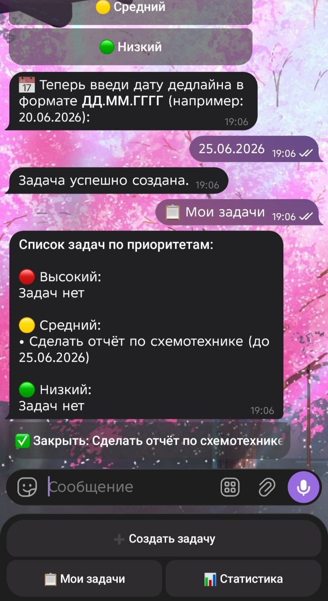
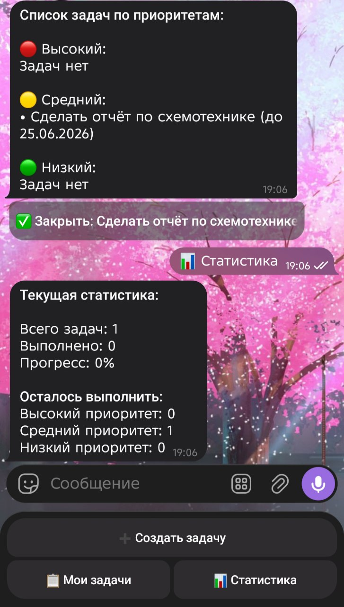
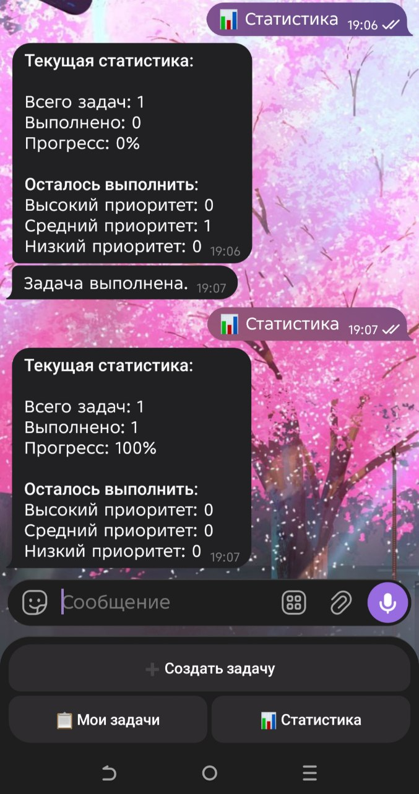

# ChronoTaskBot

Удобный Телеграм-бот на Java для управления задачами и личными делами. Помогает записывать задачи, распределять их по уровню важности, ставить дедлайны и наглядно следить за своей продуктивностью.

## Что умеет бот

* **Пошаговое создание задач:** Бот плавно ведёт по шагам - просит ввести название дела, выбрать его приоритет кнопкой, а затем указать дату дедлайна в удобном формате (ДД.ММ.ГГГГ).
* **Сортировка по важности:** Все задачи распределяются по блокам: Высокий 🔴, Средний 🟡 и Низкий 🟢 приоритет, чтобы сразу видеть главное.
* **Выполнение в один клик:** Прямо под списком задач появляется удобная кнопка. Нажал на неё и задача мгновенно отмечается как выполненная.
* **Личная статистика:** Бот умеет считать общее количество дел, количество выполненных задач, выводить общий прогресс в процентах (%) и показывать, сколько дел каждого приоритета еще осталось сделать.
* **Задачи не пропадают:** Всё сохраняется в локальный JSON-файл на компьютере. Бот можно спокойно перезапускать, и список дел останется на месте.

---
## Технологический стек

Проект написан на чистой Java:

* **Java Core:** Использование принципов ООП, коллекций (List, Map) для управления задачами и работы с датами для контроля дедлайнов.
* **Telegram Bots API:** Настройка бэкэнда для бота, обработка пошаговых команд пользователя и управление инлайн-кнопками.
* **JSON:** Локальное хранение данных. Реализована сериализация и десериализация объектов для сохранения и загрузки задач при перезапуске.
* **Maven:** Сборка проекта и автоматическое управление внешними зависимостями.

## Интерфейс и примеры работы

Вот как выглядит весь процесс работы с таск-менеджером в Телеграме:

### 1. Создание новой задачи с дедлайном

### 2. Просмотр списка текущих задач и кнопка закрытия

### 3. Панель статистики и учёт прогресса

### 4. Успешное выполнение задачи (Прогресс 100%)

